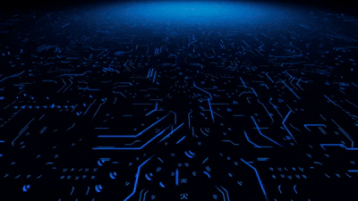
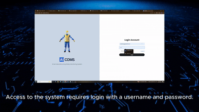
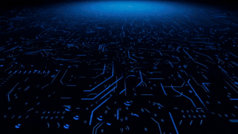

# 🛡️ Real-Time Safety Monitoring System

Welcome to the **Real-Time Safety Monitoring System**, a comprehensive web-based application designed to enhance workplace safety through **real-time monitoring** of **PPE (Personal Protective Equipment)** compliance using **AI-powered computer vision**.

This system helps automate and improve safety in high-risk environments such as **construction sites, warehouses, and factories**, detecting if workers are missing critical safety gear (helmet, vest, glasses) via live camera streams and real-time alerts.

---

## 🎥 Demo Preview

> 📌 Add your GIFs below by replacing the image paths.

### 🏁 Welcome Page  


### 📊 Dashboard, Login, Summary  


### 🕒 Timeline, Report Page  


---


## 💡 Why This Project?

Safety is a top priority in industrial environments. Manual monitoring of PPE is inefficient and prone to errors. We wanted to build a system that:

- 📹 Monitors workers via live camera feeds
- 🤖 Uses AI to detect missing PPE instantly
- 🖥️ Visualizes incidents, trends, and reports in a responsive web dashboard
- 🌐 Supports multiple languages and is easy to use

---

## 🌟 Key Features

- 🔐 **User Login**: Secure, role-based login system
- 📺 **Real-Time Camera Feed**: Monitor up to 6 live cameras
- 🚨 **AI-Powered Detection**: YOLOv8 detects helmet, vest, and glasses violations
- 📈 **Summary Dashboard**: Weekly trend charts, safety score, alert heatmaps
- 📅 **Timeline View**: Camera-wise alert history
- 📁 **Report Page**: Alert logs, worker data, manual reporting
- ⚙️ **Settings Page**: Theme toggle (Dark/Light), language switch
- 🌗 **Dark & Light Modes**: User-selectable interface theme
- 🌍 **Multi-Language Support**: English 🇺🇸 and Korean 🇰🇷 with `react-i18next`
- 📤 **CSV Download**: Export alerts for safety audits

---

## 🧠 AI Integration

- 🤖 Model: **YOLOv8n**  
- 🖼️ Dataset:  
  - **Phase 1**: 1,176 images  
  - **Phase 2**: 2,551 images (focused on head detection)

- ⚙️ Inference Process:
  ```plaintext
  [Camera Feed] → [YOLO AI (Subprocess)] → [Annotated Frame + Label] → [FastAPI Backend] → [Frontend UI]

## 🏗️ System Architecture

Frontend (React.js)     <->    FastAPI Backend    <->    YOLOv8 AI Detection
     |                                 |                     |
  React Router                  SQLAlchemy ORM         Camera Stream + Alert Engine
     |                                 |
LocalStorage, Axios             MySQL Database

## 🖥️ Web Pages Overview

| Page            | Description                                                |
|-----------------|------------------------------------------------------------|
| Welcome Page    | Project intro and smooth entry animation                   |
| Login Page      | Secure form-based authentication                          |
| Dashboard       | 6-camera grid view, real-time overlay alerts               |
| Camera Detail   | Individual camera feed, filterable alerts                  |
| Summary         | Safety scores, trend graphs (Recharts)                     |
| Timeline        | Chronological alerts per camera                            |
| Report          | Searchable worker alert logs and manual report entry       |
| Settings        | Theme, language, and future preferences                    |
| Info            | System explanation and contact/support section             |

## ⚙️ Technology Stack
| Layer      | Stack & Tools                                           |
|------------|---------------------------------------------------------|
| 🎨 UI/UX     | Figma, Minimalist Blue-White design                    |
| 📱 Frontend | React.js, SCSS, Bootstrap, Recharts, Axios, i18next    |
| 🧠 AI        | YOLOv8n, Python Multiprocessing                        |
| 🔧 Backend   | FastAPI (Python), RESTful API                          |
| 🗃️ Database  | MySQL, SQLAlchemy ORM                                  |

## 🧩 React Features & Hooks
- `useState` — UI reactivity for alerts and toggles
- `useEffect` — Poll backend every 10s for new alerts
- `useMemo` — Sort/aggregate alerts efficiently
- `useParams` — Route-based camera ID handling
- `useOutletContext` — Share layout state between nested pages

## 🛠️ Future Improvements
- 🔍 Add fire/fall/smoke detection modules
- 🔔 Alert notification via email/SMS
- ☁️ Cloud deployment (AWS/GCP)
- 🔐 Advanced admin dashboard
- 📲 Mobile app version

## 📁 Repository
🔗 GitHub: [Web_Software_Project](https://github.com/abbosaliboev/Web_Software_Project.git)

For feedback or contributions, feel free to fork or reach out!
